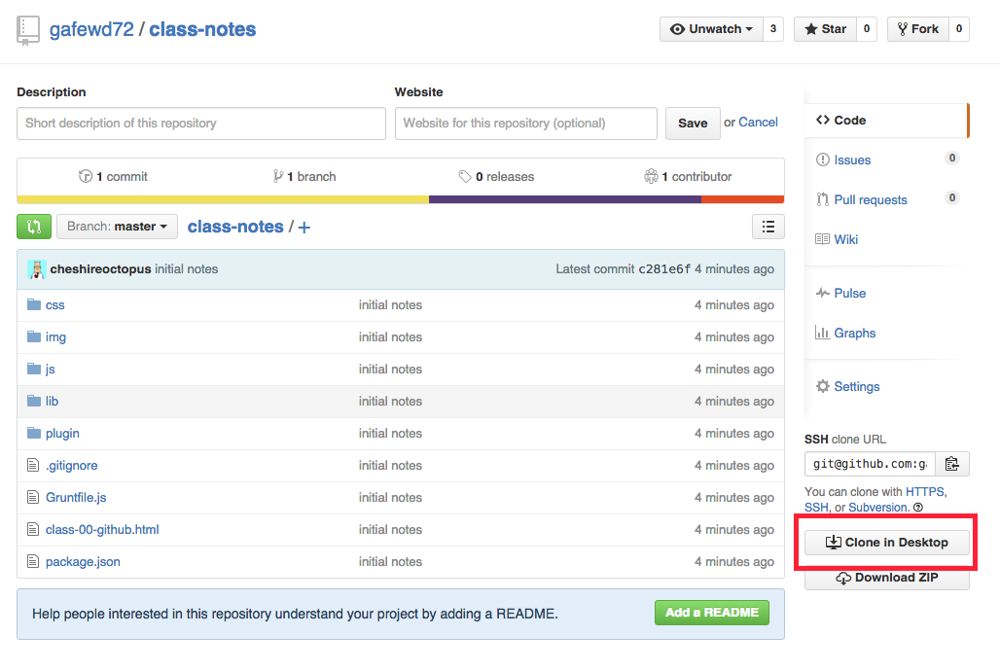

# Class Notes

This repo contains all of the notes for FEWD 72. The notes are in HTML format and are powered by a JavaScript framework called [Reveal.js](http://lab.hakim.se/reveal-js/).

In order to view these notes, you must __clone__ this repository. To do so, click the __Clone in Desktop__ button to the right:

The notes are found in the `.html` files. Ex: `class-00-github.html`. Once you have cloned the repo to your local machine, open these files in a browser and use the arrow keys to navigate through them.

This repo will be udpated at the end of every class to include the latests notes.
